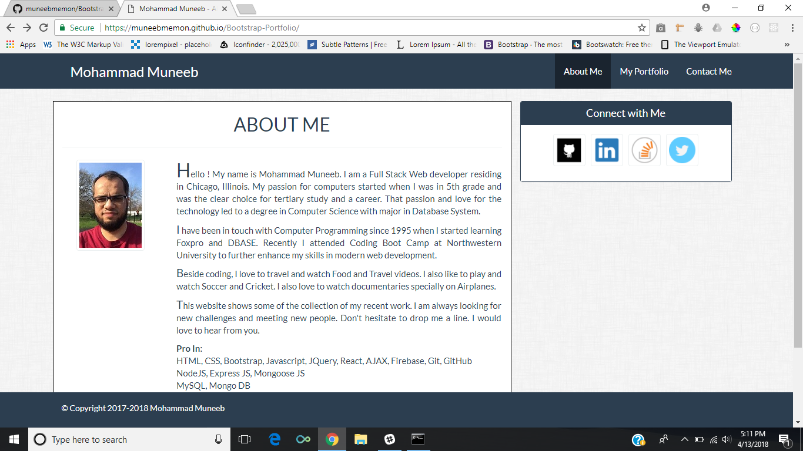
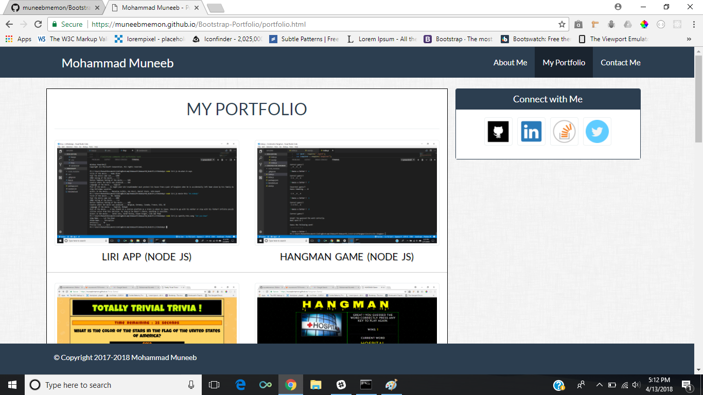
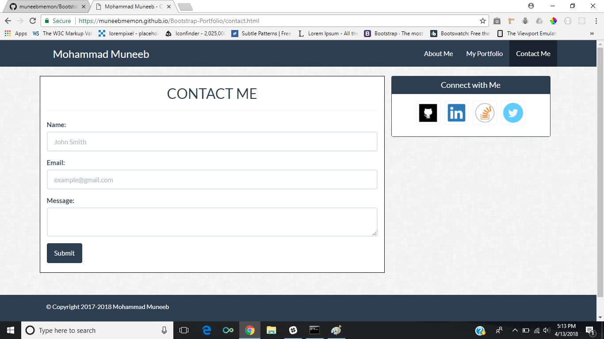

# Simple Portfolio using Bootstrap

This portfolio was built using Bootstrap. It has the BIO page which contains a short bio of me, Portfolio page which showcase my different projects and Contact page for contacting me. It also has CONNECT ME section with different ways to connect with me.

* About Page

* Portfolio Page

* Contact Page

## Technologies used

- Javascript
- CSS
- HTML
- Bootstrap 3
